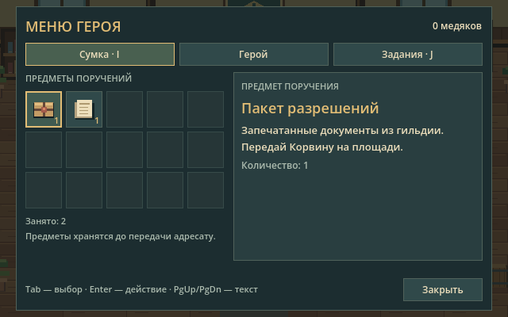

# EllaraRPG

2D-прототип Эллары: гильдия и центральная площадь, оригинальная временная
пиксельная графика, Филипп, Мира, Корвин, три поручения и пять рабочих мини-игр.
Godot 4.7.2, GDScript, Compatibility.

Начинать продолжение разработки с [PROJECT_STATE.md](PROJECT_STATE.md).
Решения и результаты проверок — в [журнале разработки](DEVELOPMENT_LOG.md),
следующие этапы — в [плане](DESIGN_ROADMAP.md), правила интерфейса —
в [UI_DESIGN.md](docs/UI_DESIGN.md).

Подтверждённое направление: приключенческая action RPG с боем в реальном
времени, добычей и экипировкой, движением WASD. Бой и экипировка — следующий
этап, текущая версия проверяет гильдию, поручения и меню героя.



## Запуск

Открыть `project.godot` в Godot и нажать **F6** для текущей сцены гильдии
или **F5** для запуска проекта. Главная сцена уже назначена.

- **WASD** (физические клавиши, в том числе при русской раскладке) или **стрелки** — ходить.
- Подойти к стойке Миры спереди; при появлении подсказки нажать **E**.
- «Принять» добавляет поручение в журнал. «Отказаться» закрывает предложение;
  позже можно снова поговорить с Мирой и принять его.
- **J** — открыть/закрыть журнал. **Esc** — открыть паузу в любой момент.
- **I** — меню героя: вкладки «Сумка», «Герой», «Задания». I и J переключают
  вкладки напрямую; повторное нажатие той же клавиши закрывает окно.
- В журнале выбрать поручение и нажать «Отслеживать на экране». HUD показывает
  его следующий шаг; выбор сохраняется. Активные и завершённые задания разделены.
- Предметы выделяются мышью, Tab или стрелками; описание и адресат видны рядом.
- Кнопки внизу игрового экрана открывают сумку, задания и паузу мышью.
  Рядом с доступным действием появляется кликабельная кнопка **E**.
- **PgUp / PgDn** прокручивают длинный текст задания/диалога. **Esc → Управление**
  показывает памятку. Пауза возвращает фокус в прежнее окно.
- У нижнего порога гильдии нажать **E**, чтобы выйти на площадь. Вход обратно —
  у двери здания слева. Корвин стоит рядом с торговыми навесами справа.
- Корвин поручит три дела: разобрать доски у бочек, расставить товар на синем
  прилавке и закрепить красный навес. Подойти к отметке и нажать **E**.
  Доски и товары нужно распределять кнопками или клавишами **1–3**. Навес — трижды
  нажать **Пробел**, когда бегунок находится в зелёной зоне. Ожидание работу не
  выполняет. **Q** отменяет мини-игру без завершения работы, **Esc** ставит её на паузу.
- После трёх дел поговорить с Корвином и нажать «Сдать работу». Вернуться к Мире
  и нажать «Получить 18 медяков». Оплата поступает в личный кошелёк один раз.
- **Enter** на выбранной кнопке или щелчок по «Закрыть» — закрыть окно задания.
- У Миры выбрать «Другие поручения»: «Порядок в гильдейском архиве» (8 медяков)
  и «Пакет для Корвина» (6 медяков). Их можно принять одновременно.
- Рабочее место — доска в правом верхнем углу гильдии. Подойти спереди, нажать
  **E** и выбрать поручение. В архиве распределить пять документов по папкам;
  для доставки — вложить, перевязать и запечатать пакет в правильном порядке.
- После архива показать результат Мире через «Другие поручения». Пакет лично
  передать Корвину отдельной кнопкой в разговоре, затем принести расписку Мире.
  Предметы заданий появляются в инвентаре и уходят при сдаче. Повторная оплата исключена.

Во время просмотра движение и переходы заблокированы. Стены, стойка, столы,
здания, фонтан и остальная мебель имеют столкновения. Камера следует за героем
в пределах локации. Сцена рассчитана
на 640×400 внутренних пикселей, стартовый размер окна — 1280×800.

## Структура

- `scenes/guild.tscn` — главная сцена и исходные позиции персонажей.
- `scenes/player.tscn`, `scripts/player.gd` — герой, камера и движение.
- `scripts/pixel_character.gd` — временная внешность и четыре направления анимации.
- `scripts/room.gd`, `scripts/furniture.gd` — оформление помещения и мебель.
- `scripts/guild.gd` — сборка гильдии и зоны её взаимодействия.
- `scripts/world_location.gd` — общие управление, подсказки, камера через игрока и переходы.
- `scenes/square.tscn`, `scripts/square.gd`, `scripts/square_art.gd` — площадь и Корвин.
- `scripts/game_state.gd` — принятие задания и встреча с Корвином, общие для локаций.
- `scenes/main_menu.tscn`, `scripts/main_menu.gd` — главное меню и пять слотов сохранений.
- `scripts/pause_menu.gd` — пауза поверх текущего диалога или действия.
- `scripts/activity_game.gd` — рабочие мини-игры с выбором и попаданием в зону.
- `scripts/character_panel.gd` — сумка, герой, журнал, предложения и рабочее место.
- `scripts/ui_theme.gd`, `scripts/item_icon.gd` — стили, фокус и оригинальные иконки.
- `scripts/game_hud.gd` — цель, кошелёк, кнопки мыши и уведомления сохранения.
- `scripts/quest_catalog.gd` — определения двух новых поручений и предметов.
- `scripts/work_spot.gd` — отметки мест работы и выполненных действий.
- `scripts/quest_dialogue.gd` — разговоры с Мирой и Корвином, ответы и условия работы.
- `tests/guild_smoke.gd` — проверка запуска и основных взаимодействий.
- `tests/quest_flow.gd` — полный путь поручения и переходов, включая отказ и повторные диалоги.
- `tests/quest_completion.gd` — работа, отмена, частичный прогресс, приёмка и защита от повторной оплаты.
- `tests/character_animation.gd` — проверка стабильности головы при ходьбе.
- `tests/save_and_pause.gd` — сохранения, загрузка, пауза и подтверждения перезаписи/удаления.
- `tests/quests_inventory.gd` — полный путь новых поручений, предметы, знания NPC и загрузка старых сохранений.
- `tests/keyboard_input.gd` — коды клавиш Windows, EN/RU, отпускание движения.
- `tests/ui_workflow.gd` — фокус, вкладки, отслеживание, прокрутка и размеры окон.
- `DESIGN_ROADMAP.md` — ориентиры, игровой цикл и порядок развития вертикального среза.

## Границы прототипа

Это отдельная техническая сцена, а не продолжение сохранённого ролевого эпизода.
Временные изображения, новая реплика Миры и размещение предметов не утверждают
новые факты канона. По авторской правке для видеоигры Филипп действует один:
это личное поручение на подготовку ярмарки, 18 медяков лично герою, подпись Корвина
перед расчётом у Миры. Кошелёк новой игровой сессии начинается с нуля; это отдельное
состояние прототипа, оно не заменяет неизвестный баланс из ролевого сохранения.
Реализован полный путь: принятие, три работы, приёмка Корвином и выплата Мирой.
Повторные принятие, выполнение отдельной работы и оплата исключены. После оплаты
задание показывается в журнале как завершённое. Отказ не блокирует повторное
предложение. Прогресс записывается на диск в один из пяти слотов. Ручное сохранение
доступно, когда Филипп свободно стоит; выбранный слот становится текущим. Игра
автоматически сохраняется после важных этапов задания, работы и переходов, а также
при выходе. Перезапись занятого слота и удаление требуют подтверждения. Esc открывает
паузу всегда и сохраняет открытый диалог или незавершённое действие; Q отменяет
работу. Состояние ролевой кампании не меняется.

Сохранения версии 1 совместимы: новые поручения и пустой инвентарь добавляются
при загрузке. Версия 2 хранит предметы, характеристики, этапы новых поручений,
рабочее доверие и факты, известные Мире и Корвину. Незавершённая мини-игра остаётся
на текущем шаге при паузе, но после выхода и загрузки начинается заново.
Характеристики — временный баланс видеоигры: шесть базовых значений по 1,
магия и удача по 0, уровень 1 и ранг F. Эти значения не перенесены из ролевого
сохранения и пока не влияют на сложность мини-игр. Обычные ошибки не штрафуют деньгами.

Выбор отслеживаемого поручения — необязательное поле `tracked_quest` формата 2.
Если поля нет или выбранное поручение уже завершено, HUD выбирает активное автоматически.

Графика рисуется средствами Godot, внешние изображения и ассеты Stardew Valley
не используются. Мебель создаётся при запуске; в редакторе видны фон и персонажи.

Движение использует стандартный подход Godot:
[CharacterBody2D и Input.get_vector](https://docs.godotengine.org/en/stable/tutorials/2d/2d_movement.html).

## Проверка

Полный набор, включая анимацию (PowerShell):

```powershell
.\tests\run_checks.ps1 -GodotPath 'C:\путь\к\Godot_console.exe' -IncludeVisual
```

Проверка считается неуспешной также при ошибке скрипта Godot с кодом выхода 0.
Тесты сохранений используют собственные временные папки, игровые слоты не трогают.

```powershell
Godot --headless --path . --editor --import
Godot --headless --path . --script res://tests/guild_smoke.gd
Godot --headless --path . --script res://tests/quest_flow.gd
Godot --headless --path . --script res://tests/quest_completion.gd
Godot --headless --path . --script res://tests/save_and_pause.gd
Godot --headless --path . --script res://tests/quests_inventory.gd
Godot --headless --path . --script res://tests/keyboard_input.gd
Godot --headless --path . --script res://tests/ui_workflow.gd
Godot --path . --script res://tests/character_animation.gd
```

Если `Godot` не добавлен в PATH, указать полный путь к исполняемому файлу.

Для повторной отрисовки примеров интерфейса запустить графический Godot:

```powershell
Godot --path . --script res://tests/ui_workflow.gd -- --capture=C:/absolute/output/directory
```

Папку создать заранее. Изображения показывают тестовый прогресс, не сохранение автора.
