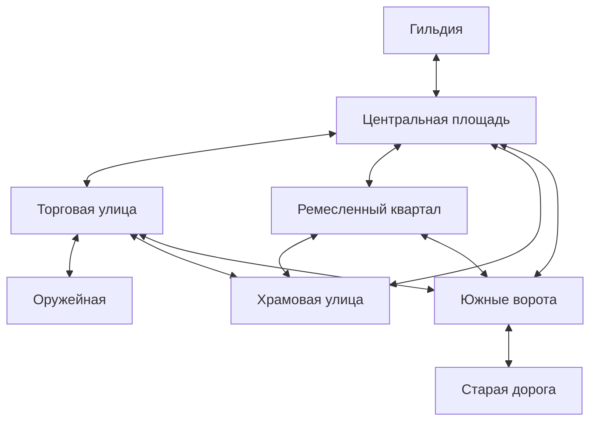

# Первый городской срез Эльгарда

Авторский запрос: связать гильдию, работу, исследование города, оружейную,
первую покупку и выход к Старой дороге. Новых врагов и развития боя на этом этапе нет.

## Маршрут

Гильдия остаётся базой на центральной площади. Восток площади ведёт на торговую
улицу, запад — к ремесленникам, север — к храму, юг — к воротам. Торговая и
ремесленная улицы также соединяются с храмовой улицей и Южными воротами.
Это небольшой городской круг с несколькими путями возвращения.

Двери и границы районов работают через E и контекстное действие. Стражник у
ворот предупреждает, но ничего не проверяет и не запрещает. Возврат со Старой
дороги теперь ведёт к Южным воротам. Сама дорога, пост, находка, засов и
сохранённые открытия остаются прежними. Старый выход с востока площади заменён
городским переходом, а не вторым прямым выходом в лес.

Торговая улица — тёплая штукатурка, навес и вывеска клинка; ремесленный квартал —
уголь, горн, отливка и рабочие дворы; храмовая улица — светлый камень, ступени,
светильники и зелень. Южные ворота — кладка, башни, колеи и переход к приглушённой
палитре окраины. Геометрия препятствий задаётся в city_layout и используется
при отрисовке и создании столкновений.

## Гильдия и люди

Ирридия, Селеста и Астра сидят за общим правым столом. У каждой по две короткие
реплики, без спутников, новых заданий, управления группой и отношений.
В районах по одному фоновому NPC: торговка, подмастерье, паломница и стражник.
Оружейник Рем продаёт кинжал. Разговоры открываются в привычной нижней панели;
фоновые осмотры описывают место и не выдают опыт или награды.

Это отдельное состояние видеоигры. Новые реплики, внешность временных спрайтов,
название лавки и детали улиц не дописывают канон ролевой кампании.

## Первая покупка и экипировка

- Оружейная «У старого клинка» — отдельный интерьер на торговой улице, с прилавком,
  оружейником, стойками, печью и коротким осмотром клинков.
- Простой кинжал стоит ровно 24 медяка. Для этого хватает прежней оплаты за площадь
  (18) и доставку разрешений (6). Новых выдач денег и обходов мини-игр нет.
- Покупка требует находиться у прилавка, иметь деньги и ещё не владеть кинжалом.
  Она списывает 24 и добавляет simple_dagger в количестве 1. Повтор исключён,
  в том числе после снятия оружия и загрузки. Торговли обратно пока нет.
- Покупка не экипирует предмет молча. В сумке доступны «Экипировать» / «Снять оружие»;
  на вкладке «Герой» есть минимальный слот оружия с теми же действиями.
- Успешная покупка и смена экипировки автосохраняются. Если запись не удалась,
  изменение откатывается: покупатель сохраняет деньги, прежнее оружие остаётся.

Модель оружия отделена в weapon_catalog: пока базовый урон без оружия 1,
кинжала 6. По исправлению автора post_combat получает это значение через
GameState.weapon_base_damage() при начале каждого удара. Кулак и короткий
кинжал рисуются по экипировке; оружие в сумке без экипировки не влияет на бой.
Ползун имеет 18 здоровья: 18 попаданий кулаком или 3 кинжалом. Урон виден
в магазине, карточке предмета и слоте оружия. Это временные значения P2.
Формат слотов остаётся 5. Успешные переходы автосохраняются тихо, ошибки
записи и подтверждение ручного сохранения продолжают отображаться.

## Сохранения

Формат 5: инвентарь хранит simple_dagger, новое поле equipped_weapon — пустую строку
либо simple_dagger. Экипировать не принадлежащее герою оружие нельзя.
Версии 1–4 загружаются с пустым слотом оружия; деньги, вещи, задания, открытия
и прежняя победа сохраняются по существующим миграциям. Новые локации входят
в допустимый список сцен и корректно именуются в выборе сохранений.

## Проверки и остановка

tests/city.gd: достаточная/недостаточная сумма, повторная покупка, однократное
списание, сохранение вещи и обоих состояний экипировки, версии 1–4, отказ
некорректной экипировке, откат при ошибке записи, покупка мышью и экипировка
клавиатурой, пауза и диалоги. Каждый городской переход проходится физически,
после чего проверяется целевая сцена. Богини доступны у общего стола.
tests/city_views.gd: кадры улиц, оружейной, осмотров, стола и меню героя.
tests/exploration.gd продолжает проверять старый маршрут через новый городской выход.
Все тесты используют отдельные временные данные; реальные слоты не трогаются.

Фактические результаты записываются в DEVELOPMENT_LOG. После реализации
остановиться для прохождения Филиппом. Не добавлять врагов, новый боевой этап,
рост, храмовые услуги, ремесло или дополнительные магазины самостоятельно.
